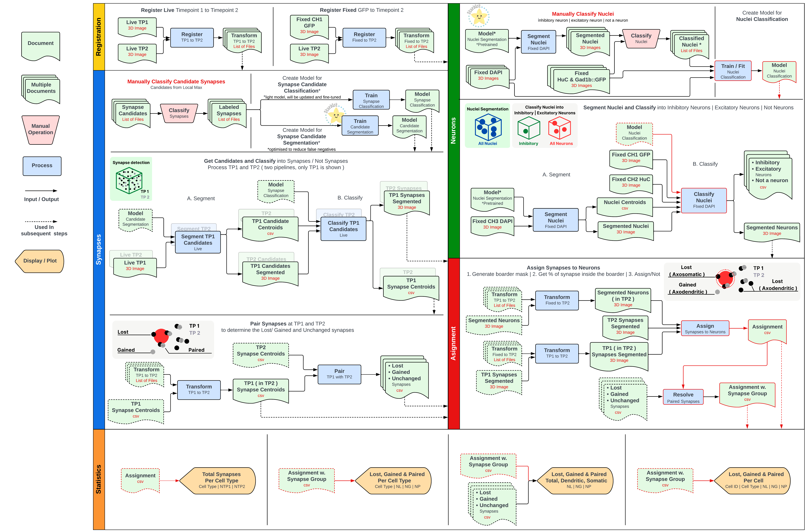

# InhiPy: Python Utils for Inhibitory Synapses and Threat Circuit Analysis

Hey there, Neuro-Ninja! How did you find this repo?

🧠🐟 Welcome to InhiPy, your Python helper for diving deep into the amazing world of inhibitory synapses and threat circuits.

We're all about exploring the small but mighty world of larval zebrafish. Why? Because they're transparent, and we can see all the magic happening right inside their tiny brains!

This repo is under construction with the ultimate goal to implement the following pipeline:



I know it doesn't speak for itself... and looks more confusing than helpful... I promise, more details will be added later.

## How to Install

Although it's not fully functioning or tested yet...so maybe wait a couple weeks :innocent:

1. Clone this repo 🚀
2. Jump into the main directory
3. Run one of these commands:

```bash
pip install .        # To install
```
or
```bash
pip install -e .     # To install in super-edit mode!
```

## What Does it Do?

The goal is to have a nice modular pipeline that we can change as the project evolves. So that each blue block in the diagram above will be run with a separate [config](https://www.borealisai.com/research-blogs/using-config-files-run-machine-learning-experiments/) but everything could also be assembled into one big config for the whole pipeline is necessary. I know it probably makes little sense right now, but I'll explain everything once it's in a semi-working spot :face_with_spiral_eyes:

## How to Use

I'm still working on assembling the whole pipeline and figuring out a nice way to run things. Please bear with me! In the meantime, the notebooks are quite friendly. I'll be changing the configuration of the configs :smirk:	quite a lot in the future, but the code in the notebooks should be updates as I make those changes... so refer to that.

<!-- ## Wanna Contribute?

Fork this repository, make it even more awesome and then create a pull request. We promise we don't bite, and we love new ideas! -->

## License

This project is licensed under the terms of the BSD-3 license. See the [LICENSE](LICENSE.md) file for more details. We believe in free and open source software!

## The Science-y Stuff

We're supported by an NIH U01 grant that allows us to investigate threat circuits. Check out our [grant files](https://braininitiative.nih.gov/funded-awards/circuits-underlying-threat-and-safety) if you're into that kind of thing.

## Get in Touch

If you have any cool ideas, or just want to chat about image/data processing or neuro stuff, reach out!
